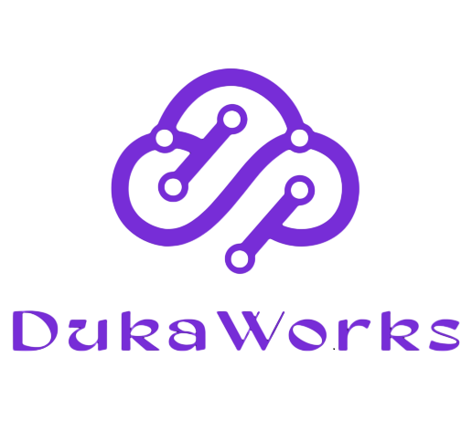

# Frpc-GUI

<p align="center">
  
</p>

<p align="center">
  <strong>Web-based GUI for managing Frpc configurations remotely via SSH</strong>
</p>

<p align="center">
  <a href="./LICENSE"></a>
  
  <a href="https://github.com/dukaworks/frpc-gui/actions/workflows/docker-publish.yml"></a>
  <br>
  <a href="https://x.com/dukatalk"></a>
  <a href="https://t.me/zychen2022"></a>
  <a href="https://t.me/+wmMDJOMbU9FhMmNl"></a>
</p>

<p align="center">
  [ <strong>English</strong> | <a href="./README_zh.md">中文</a> ]
</p>

---

**Frpc-GUI** is a modern, user-friendly web interface developed by **DukaWorks** for managing your Frpc (Fast Reverse Proxy Client) configuration files. Instead of editing TOML/INI files manually via SSH, you can use this visual dashboard to add, edit, and delete proxies, manage multiple servers, and view real-time logs with ease.

## ✨ Features

- 🚀 **Remote Management**: Connect to any server running Frpc via SSH.
- 🎨 **Visual Configuration**: User-friendly form-based editor for Frpc proxies.
- 🔄 **Full CRUD Support**: Add, Edit, Delete (Single/Batch) proxies easily.
- 🖥️ **Multi-Server Support**: Save and switch between multiple Frpc server profiles.
- 📊 **Real-time Logs**: View live logs from the running Frpc service (Docker, Systemd, or Process).
- 🛡️ **Safety First**: Built-in configuration backup and "Restart Service" safety checks.
- 📄 **TOML Support**: Native support for the modern TOML configuration format.

## 💡 Usage Scenarios & Recommendations

*   **Desktop Environment (Released Versions)**
    *   Recommended for use on **Windows PC, macOS, Laptops**, or **Linux Desktop**. Manage remote frpc services running on servers, NAS, or routers via SSH connection.

*   **Production Environment Management (Remote Management)**
    *   For frpc running in production environments like **PVE, OpenWrt (e.g., iStoreOS), or fnOS**, it is recommended to install Frpc-GUI on a separate management device (like your laptop) and manage it remotely via SSH. This "separation of control plane and data plane" approach is more robust and prevents management tools from interfering with the production environment.

*   **Future Roadmap**
    *   We plan to release an **All-In-One Docker image (Frpc + GUI)** for out-of-the-box usage. At that time, Frpc-GUI can be deployed directly on the target device as the default web management interface, integrating seamlessly with frpc.

## 📦 Quick Start

### Docker (Recommended)

#### Option 1: Docker Compose (Easiest)

```bash
# Pull and run the latest official image
docker-compose up -d
```

Access the dashboard at `http://localhost:3000`.

#### Option 2: Docker Run

```bash
docker run -d \
  --name frpc-gui \
  -p 3000:3000 \
  -v /path/to/your/frpc.toml:/etc/frp/frpc.toml \
  ghcr.io/dukaworks/frpc-gui:latest
```

### Manual Installation

1.  Clone the repository:
    ```bash
    git clone https://github.com/dukaworks/frpc-gui.git
    cd frpc-gui
    ```

2.  Install dependencies:
    ```bash
    npm install
    ```

3.  Start the development server:
    ```bash
    npm run dev
    ```

### Desktop App (Electron)

You can build a standalone desktop application for your OS (Windows, macOS, or Linux).

1.  Build the application:
    ```bash
    npm run electron:build
    ```

2.  The installer/executable will be generated in the `release` directory.

## ⚙️ Configuration Reference

A comprehensive sample configuration file is included in this repository to help you understand all available options.

*   [**frpc_sample.toml**](./frpc_sample.toml): Contains examples for TCP, UDP, HTTP, HTTPS, STCP, XTCP, and Plugin configurations.

## 🤝 Community & Support

**DukaWorks** is dedicated to creating useful tools for developers.

*   **GitHub**: [github.com/dukaworks](https://github.com/dukaworks)
*   **X / Twitter**: [@dukatalk](https://x.com/dukatalk)
*   **Telegram Channel**: [@zychen2022](https://t.me/zychen2022)
*   **Telegram Community**: [Join Group](https://t.me/+wmMDJOMbU9FhMmNl)
*   **Email**: [dukaworks.zy@gmail.com](mailto:dukaworks.zy@gmail.com)

## 🤝 Contributing

Contributions are welcome! Please read [CONTRIBUTING.md](./CONTRIBUTING.md) for details on our code of conduct, and the process for submitting pull requests.

## 📄 License

This project is licensed under the MIT License - see the [LICENSE](./LICENSE) file for details.

---

<p align="center">
  <sub>Built with ❤️ by <a href="https://github.com/dukaworks">DukaWorks</a></sub>
</p>
