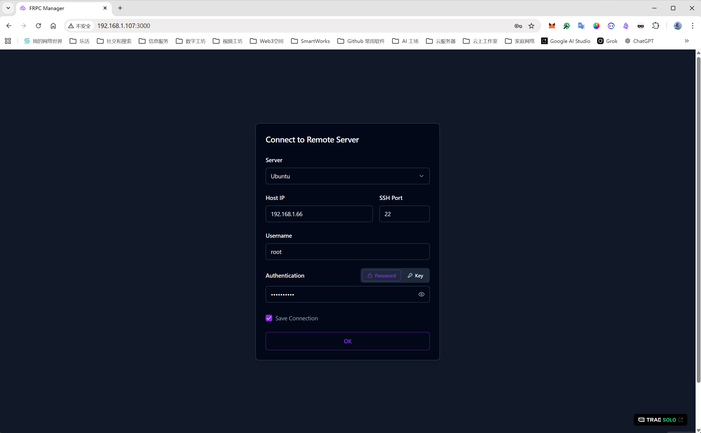
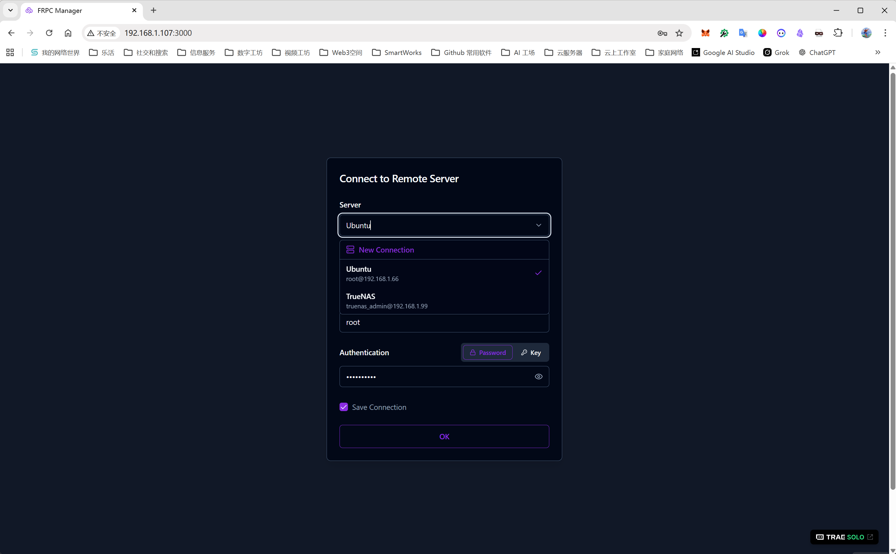
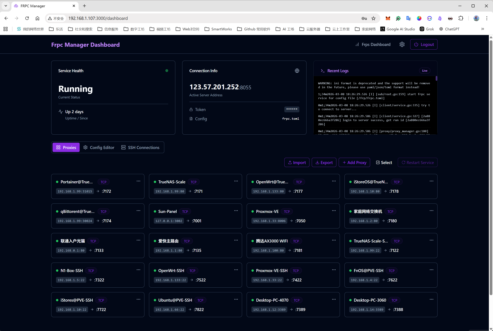
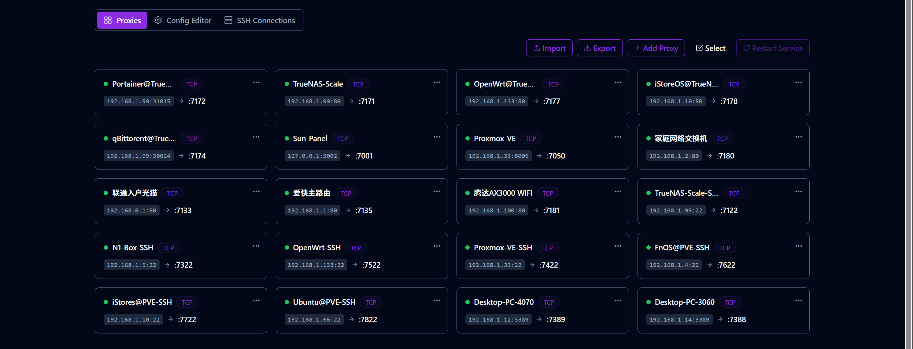
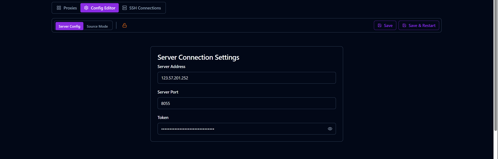
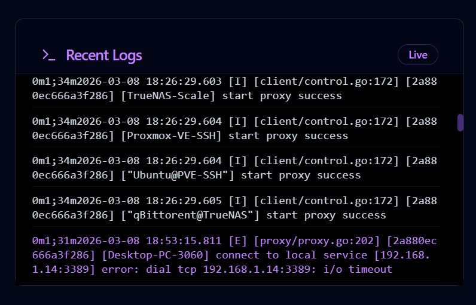
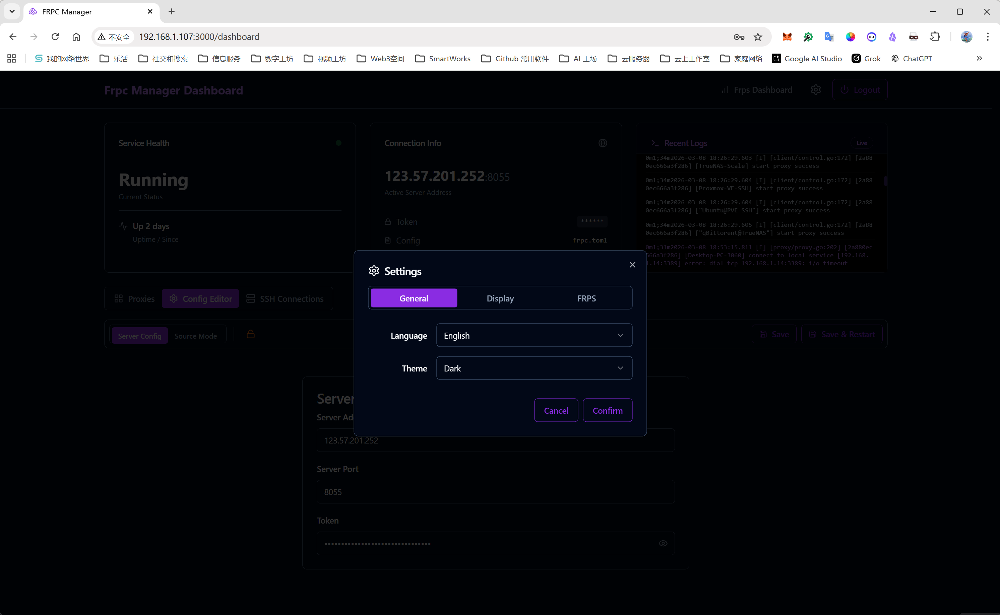
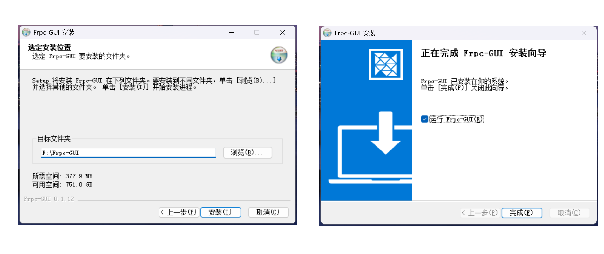

# Frpc-GUI

<p align="center">
  
</p>

<p align="center">
  <strong>Web-based GUI for managing Frpc remotely (via SSH)</strong>
</p>

<p align="center">
  <a href="./LICENSE"></a>
  <a href="https://github.com/dukaworks/frpc-gui/releases"></a>
  <a href="https://github.com/dukaworks/frpc-gui/actions/workflows/docker-publish.yml"></a>
  <a href="https://github.com/dukaworks/frpc-gui/actions/workflows/desktop-release.yml"></a>
  <br>
  <a href="https://x.com/dukatalk"></a>
  <a href="https://t.me/zychen2022"></a>
  <a href="https://t.me/+wmMDJOMbU9FhMmNl"></a>
</p>

<p align="center">
  [ <strong>English</strong> | <a href="./README_zh.md">中文</a> ]
</p>

---

**Frpc-GUI** is a modern dashboard for managing **frpc** (Fast Reverse Proxy Client) on remote machines over **SSH**. It replaces “SSH + nano” with a visual workflow: connect, edit proxies/config, and restart the service when needed.

If you mainly run frpc on routers / NAS / servers (PVE, OpenWrt, fnOS, etc.), the recommended setup is: install Frpc-GUI on your own PC, and manage the remote frpc via SSH.

## ✨ Features

- 🚀 **Remote management**: Connect to any server running frpc via SSH.
- 🎨 **Visual editor**: Manage proxies with a form UI (and a source/code mode when needed).
- 🔄 **CRUD**: Add / edit / delete proxies (single or batch).
- 🖥️ **Multi-server profiles**: Save and switch between multiple SSH targets.
- 📊 **Logs & status**: View logs and control frpc when running as Docker/Systemd/Process.
- 📄 **TOML friendly**: Works well with modern `frpc.toml` (INI also supported in many cases).

Supported languages: English / 中文 (i18n).

## 🧭 Table of Contents

- [Screenshots](#-screenshots)
- [Quick Start](#-quick-start)
  - [Desktop (Recommended)](#desktop-recommended)
  - [Docker](#docker)
  - [Development](#development)
- [How It Works](#-how-it-works)
- [Security Notes](#-security-notes)
- [Roadmap](#-roadmap)
- [Configuration Reference](#️-configuration-reference)
- [Community & Support](#-community--support)
- [Contributing](#-contributing)
- [License](#-license)

## 🖼️ Screenshots

English UI screenshots (Chinese UI screenshots are in [README_zh.md](./README_zh.md)).

**Connect / Login**


**Saved Servers**


**Dashboard Overview**


**Proxies**


**Config Editor**


**Logs**


**Settings**


**Windows Installer**


## 📦 Quick Start

### Desktop (Recommended)

Download from GitHub Releases:

- https://github.com/dukaworks/frpc-gui/releases

Artifacts include:

- Windows: `.exe` installer + `.zip`
- macOS: `.dmg`
- Linux: `.deb`

### Docker

#### Option 1: Docker Compose (Easiest)

```bash
# In this repository directory
docker compose up -d
```

Access the dashboard at `http://localhost:3000`.

#### Option 2: Docker Run

```bash
docker run -d \
  --name frpc-gui \
  -p 3000:3000 \
  ghcr.io/dukaworks/frpc-gui:latest
```

Notes:
- If you use Frpc-GUI mainly to manage remote frpc via SSH, you don't need to mount any local config file.
- If you want the container to edit a local `frpc.toml` on the host, mount it (e.g. `/etc/frp/frpc.toml`).

#### Option 3: All-In-One (AIO) with frpc (Local Mode)

If you want to run **frpc-gui + frpc** together in one environment and manage the local config directly, use the AIO compose file:

```bash
docker compose -f docker-compose.aio.yml up -d
```

It uses `FRPC_GUI_MODE=local` and a shared volume for `/etc/frp/frpc.ini` (created automatically on first run if missing).

To enable `reload/status` checks via frpc's admin API, ensure your frpc config includes an admin server:

INI:

```ini
[common]
admin_addr = 0.0.0.0
admin_port = 7400
admin_user = admin
admin_pwd  = admin
```

TOML:

```toml
webServer.addr = "0.0.0.0"
webServer.port = 7400
webServer.user = "admin"
webServer.password = "admin"
```

See:

- [docker-compose.aio.yml](./docker-compose.aio.yml)
- [.env.local.example](./.env.local.example)

### Development

1.  Clone the repository:
    ```bash
    git clone https://github.com/dukaworks/frpc-gui.git
    cd frpc-gui
    ```

2.  Install dependencies:
    ```bash
    npm install
    ```

3.  Start the development server:
    ```bash
    npm run dev
    ```

Build a desktop installer locally:

```bash
npm run electron:build
```

The installer/executable will be generated in the `release` directory.

## 🔧 How It Works

- The desktop app bundles a local Express server and a React UI (Electron).
- You connect to the remote machine via SSH.
- Every action (scan status, read/write config, restart service, fetch logs) runs on the target machine through the SSH session.

## 🔐 Security Notes

- SSH credentials are stored locally on your machine (browser storage / desktop app storage).
- Prefer SSH keys over passwords, and protect your private key with a passphrase.
- The app binds the embedded server to `127.0.0.1` (desktop mode) for safety.

## 🛣️ Roadmap

- Operation audit & rollback for config saves (history snapshots + one-click revert)
- More guided onboarding (first connection → next steps)

## ⚙️ Configuration Reference

A comprehensive sample configuration file is included in this repository to help you understand all available options.

*   [**frpc_sample.toml**](./frpc_sample.toml): Contains examples for TCP, UDP, HTTP, HTTPS, STCP, XTCP, and Plugin configurations.

## 🤝 Community & Support

**DukaWorks** is dedicated to creating useful tools for developers.

*   **GitHub**: [github.com/dukaworks](https://github.com/dukaworks)
*   **X / Twitter**: [@dukatalk](https://x.com/dukatalk)
*   **Telegram Channel**: [@zychen2022](https://t.me/zychen2022)
*   **Telegram Community**: [Join Group](https://t.me/+wmMDJOMbU9FhMmNl)
*   **Email**: [dukaworks.zy@gmail.com](mailto:dukaworks.zy@gmail.com)

## 🤝 Contributing

Contributions are welcome! Please read [CONTRIBUTING.md](./CONTRIBUTING.md) for details on our code of conduct, and the process for submitting pull requests.

## 📄 License

This project is licensed under the MIT License - see the [LICENSE](./LICENSE) file for details.

---

<p align="center">
  <sub>Built with ❤️ by <a href="https://github.com/dukaworks">DukaWorks</a></sub>
</p>
