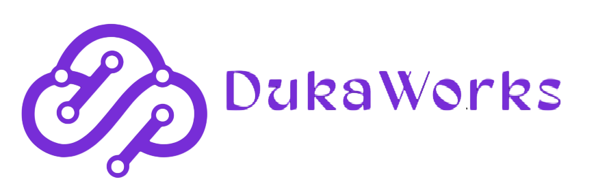
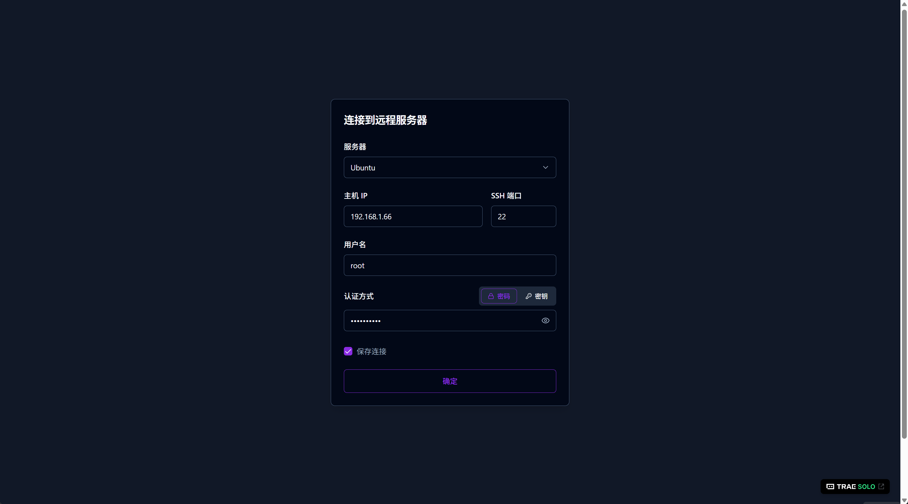
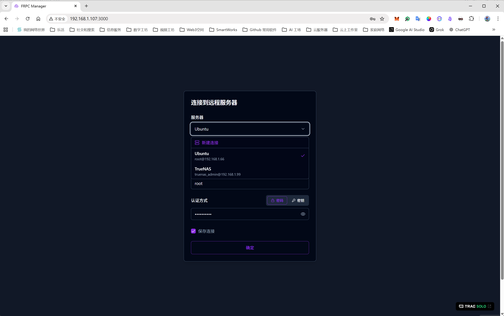
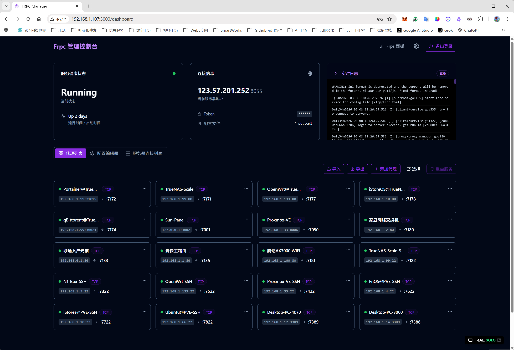
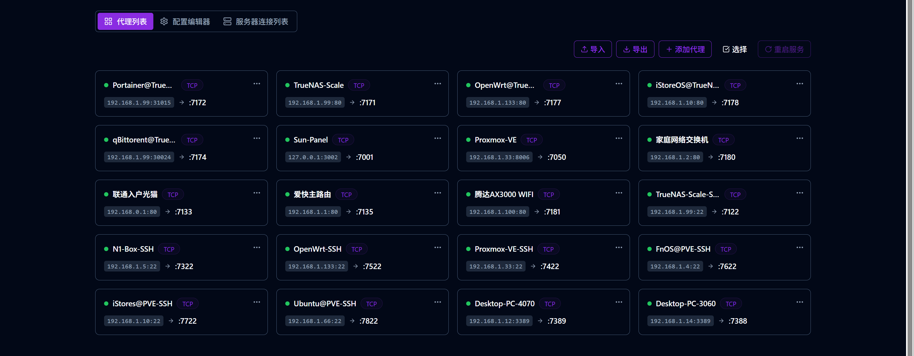
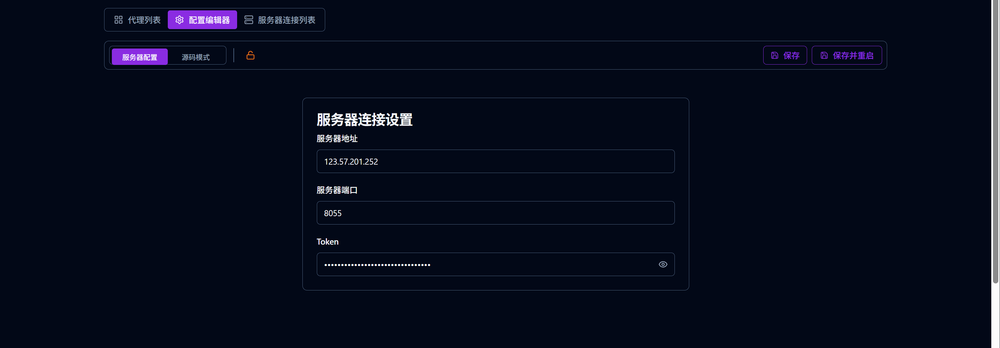
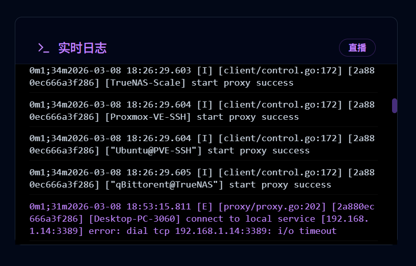
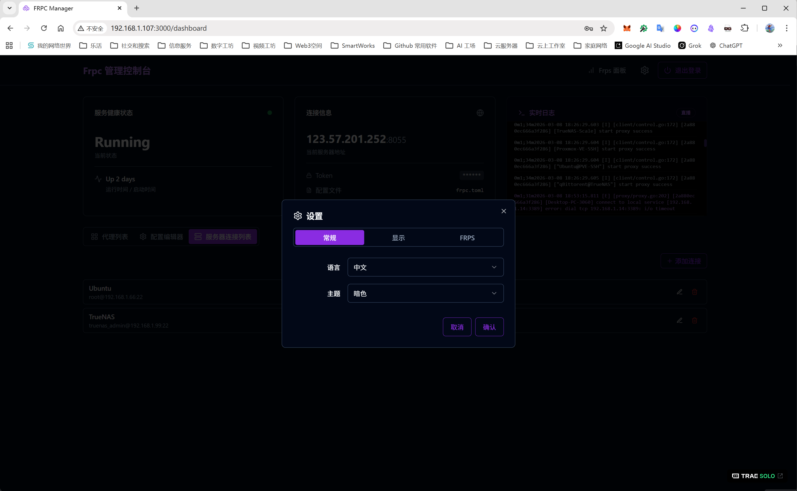
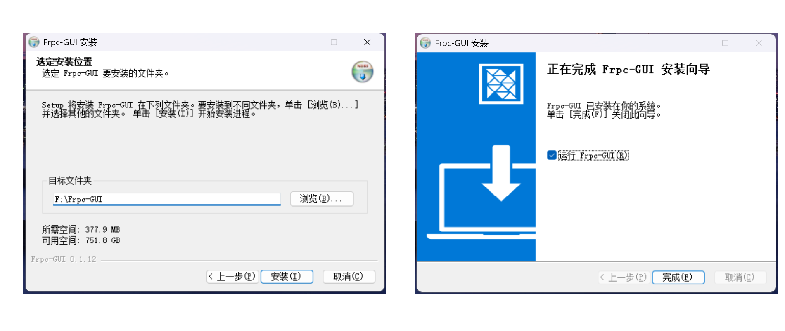

# Frpc-GUI

<p align="center">
  
</p>

<p align="center">
  <strong>基于 Web 的 Frpc 远程配置管理工具（通过 SSH）</strong>
</p>

<p align="center">
  <a href="./LICENSE"></a>
  <a href="https://github.com/dukaworks/frpc-gui/releases"></a>
  <a href="https://github.com/dukaworks/frpc-gui/actions/workflows/docker-publish.yml"></a>
  <a href="https://github.com/dukaworks/frpc-gui/actions/workflows/desktop-release.yml"></a>
  <br>
  <a href="https://x.com/dukatalk"></a>
  <a href="https://t.me/zychen2022"></a>
  <a href="https://t.me/+wmMDJOMbU9FhMmNl"></a>
</p>

<p align="center">
  [ <a href="./README.md">English</a> | <strong>中文</strong> ]
</p>

---

**Frpc-GUI** 是由 **DukaWorks (DUKA工作室)** 开发的一款现代化仪表盘，用于通过 **SSH 远程管理 frpc**（Fast Reverse Proxy Client）。它把“SSH 登录 + nano 改配置”这套流程，变成可视化：连接、编辑代理/配置、必要时重启服务并查看日志。

如果你主要在路由器 / NAS / 服务器（PVE、OpenWrt、fnOS 等）上运行 frpc，推荐的方式是：把 Frpc-GUI 安装在你的电脑上，通过 SSH 去远程管理 frpc。

## ✨ 功能特性

- 🚀 **远程管理**：通过 SSH 连接到任何运行 Frpc 的服务器。
- 🎨 **可视化配置**：用户友好的表单式编辑器，轻松管理 Frpc 代理配置。
- 🔄 **完整的 CRUD 支持**：轻松添加、编辑、删除（单个/批量）代理。
- 🖥️ **多服务器支持**：保存并在多个 Frpc 服务器配置之间快速切换。
- 📊 **实时日志**：查看正在运行的 Frpc 服务（Docker、Systemd 或进程）的实时日志。
- 🛡️ **工作流友好**：支持“保存并重启”等常用操作路径。
- 📄 **TOML 友好**：对现代化的 `frpc.toml` 支持更佳（也兼容不少 INI 场景）。

支持语言：中文 / English（可在应用内切换）。

## 🧭 目录

- [截图](#️-截图)
- [快速开始](#-快速开始)
  - [桌面版（推荐）](#桌面版推荐)
  - [Docker（推荐）](#docker推荐)
  - [开发与本地运行](#开发与本地运行)
- [操作手册（按用户足迹）](#-操作手册按用户足迹)
- [数据与安全](#-数据与安全)
- [常见问题与排错](#-常见问题与排错)
- [未来规划（Roadmap）](#-未来规划roadmap)
- [配置参考](#️-配置参考)
- [社区与支持](#-社区与支持)
- [贡献指南](#-贡献指南)
- [许可证](#-许可证)

## 🖼️ 截图

中文界面截图（英文界面截图见 [README.md](./README.md)）。

**连接 / 登录**


**已保存服务器**


**Dashboard 总览**


**Proxies**


**配置编辑器**


**日志**


**设置**


**Windows 安装向导**


## 💡 使用场景与部署建议

*   **桌面环境 (Released Versions)**
    *   推荐在 **Windows PC、macOS、笔记本电脑** 或 **Linux 桌面环境** 中使用。通过 SSH 连接远程管理运行在服务器、NAS 或路由器上的 frpc 服务。

*   **生产环境管理 (Remote Management)**
    *   对于运行在 **PVE、OpenWrt (如 iStoreOS)、飞牛 (fnOS)** 等生产环境中的 frpc，建议将 Frpc-GUI 安装在独立的管理设备（如您的笔记本）上，通过 SSH 远程管理。这种“控制面与数据面分离”的部署方式更符合网络稳健性原则，避免管理工具对生产环境造成不必要的干扰。

*   **All-In-One (AIO) 部署**
    *   已支持使用 `docker-compose.aio.yml` 在同一套环境中运行 **frpc + Frpc-GUI**（本地模式），直接管理共享的 `frpc.toml` 配置文件（见下文 Docker 选项 3）。

## 📦 快速开始

### 桌面版（推荐）

直接从 GitHub Releases 下载：

- https://github.com/dukaworks/frpc-gui/releases

通常包含：

- Windows：`.exe` 安装包 + `.zip`
- macOS：`.dmg`
- Linux：`.deb`

### Docker（推荐）

#### 选项 1: Docker Compose (最简单)

```bash
# 在本仓库目录下
docker compose up -d
```

访问 Dashboard：`http://localhost:3000`。

#### 选项 2: Docker Run

```bash
docker run -d \
  --name frpc-gui \
  -p 3000:3000 \
  ghcr.io/dukaworks/frpc-gui:latest
```

说明：
- 如果你主要用它来“通过 SSH 管理远端 frpc”，不需要挂载任何本地 frpc 配置文件。
- 如果你希望让容器直接编辑宿主机上的 `frpc.toml`，再挂载配置文件即可（例如挂到 `/etc/frp/frpc.toml`）。

#### 选项 3: 一体化（AIO）部署（frpc + Frpc-GUI，本地模式）

如果你希望在同一套环境中运行 **frpc-gui + frpc**，并直接管理本地配置文件，可以使用仓库内提供的 AIO compose 文件：

```bash
docker compose -f docker-compose.aio.yml up -d
```

它使用 `FRPC_GUI_MODE=local` 并通过共享卷管理 `/etc/frp/frpc.toml`。参考：

- [docker-compose.aio.yml](./docker-compose.aio.yml)
- [.env.local.example](./.env.local.example)

### 开发与本地运行

1.  克隆仓库：
    ```bash
    git clone https://github.com/dukaworks/frpc-gui.git
    cd frpc-gui
    ```

2.  安装依赖：
    ```bash
    npm install
    ```

3.  启动开发服务器：
    ```bash
    npm run dev
    ```

本地构建桌面安装包：

```bash
npm run electron:build
```

生成的安装包/可执行文件将位于 `release` 目录下。

## 🧭 操作手册（按用户足迹）

### 1) 连接服务器（SSH）

1. 打开应用后进入“连接”页。
2. 新建一条 SSH 连接：填写名称、Host、端口、用户名，并选择密码或私钥认证。
3. 点击连接。连接成功后会进入 Dashboard。

说明：
- SSH 连接只用于登录服务器执行读取/写入配置、控制服务、拉取日志等操作，不需要 token。

### 2) Dashboard 三个标签页分别做什么

- Proxies：对当前服务器上的代理项做增删改查（动态生效与否取决于你是否保存配置并重启/热加载）。
- 配置（Config Editor）：只负责“这台服务器的 frpc 配置文件内容”，以及服务相关操作（保存、重启等）。
- 服务器连接列表：只维护本软件保存的 SSH 连接（增删改）。

### 3) 常用操作路径

- 新增一个代理
  1. 进入 Proxies → 添加 Proxy → 保存
  2. 进入 配置 → 保存并重启（或按界面提供的服务操作）
- 修改服务器地址/端口/token（frpc ↔ frps）
  1. 进入 配置 → 修改 server 配对信息 → 保存并重启
- 切换到另一台服务器
  1. 进入 服务器连接列表 → 选择/编辑连接 → 重新连接

## 🔐 数据与安全

- SSH 连接信息会保存在浏览器/桌面应用本地存储中（key：`frpc-user-storage`）。
- 建议优先使用“私钥”方式登录，并确保私钥文件有口令或受系统权限保护。

## 🧩 常见问题与排错

- 连接不上 SSH
  - 检查服务器防火墙/安全组是否放行 SSH 端口；确认用户名、端口、密钥/密码正确。
- 保存配置后不生效
  - 配置文件只是写入磁盘，通常需要“重启 frpc 服务”才会加载新配置。
- Proxies 状态显示异常
  - 状态徽标是根据日志做推断；如果日志窗口过短或服务未输出对应代理的关键行，可能出现误判。

## 💡 用户路径优化建议（可选）

- 连接成功后给出“下一步建议”按钮：直接跳转到 Proxies/配置。
- 在“保存并重启”前显示差异摘要（本次改了哪些代理/字段）。
- 在 Proxies 卡片上增加“最近一次相关日志片段”快捷入口，方便定位异常代理。

## ⚙️ 配置参考

本仓库包含一份详尽的示例配置文件，帮助您了解所有可用选项。

*   [**frpc_sample.toml**](./frpc_sample.toml): 包含 TCP, UDP, HTTP, HTTPS, STCP, XTCP 以及插件配置的示例。

## 🛣️ 未来规划（Roadmap）

- 配置保存操作审计 / 历史版本 / 一键回滚
- 更友好的引导：首次连接成功后给出下一步入口（Proxies / 配置 / 日志）

## 🤝 社区与支持

**DukaWorks (DUKA工作室)** 致力于为开发者创造实用的工具。

*   **GitHub**: [github.com/dukaworks](https://github.com/dukaworks)
*   **X / Twitter**: [@dukatalk](https://x.com/dukatalk)
*   **Telegram 频道**: [@zychen2022](https://t.me/zychen2022)
*   **Telegram 社区**: [加入群组](https://t.me/+wmMDJOMbU9FhMmNl)
*   **邮箱**: [dukaworks.zy@gmail.com](mailto:dukaworks.zy@gmail.com)

## 🤝 贡献指南

欢迎贡献代码！请阅读 [CONTRIBUTING.md](./CONTRIBUTING.md) 了解我们的行为准则以及提交 Pull Request 的流程。

## 📄 许可证

本项目采用 MIT 许可证 - 详见 [LICENSE](./LICENSE) 文件。

---

<p align="center">
  <sub>Built with ❤️ by <a href="https://github.com/dukaworks">DukaWorks</a></sub>
</p>
